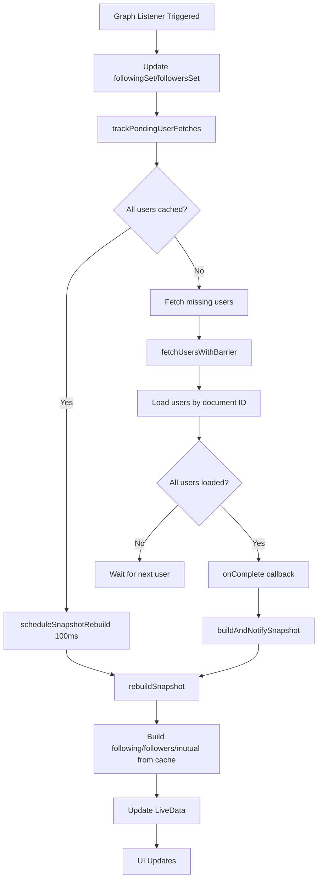

# 🔄 Cache-to-Snapshot Synchronization Fix

## 💥 THE HIDDEN PROBLEM YOU IDENTIFIED

Even after fixing the Firestore query (`document(userId)` instead of `whereIn`), there was still a **critical synchronization bug**:

### ❌ **THE BATCH COUNTER BUG**

In `fetchUsersWithBarrier()`, the code was counting **batches** but fetching **individual users**:

```java
// ❌ BROKEN LOGIC
final int totalBatches = (int) Math.ceil((double) missingIds.size() / 10);
final int[] completedBatches = {0};

for (int i = 0; i < missingIds.size(); i += 10) {
    List<String> batch = missingIds.subList(i, end);
    
    for (String uid : batch) {
        db.collection("users").document(uid).get()
          .addOnSuccessListener(doc -> {
              // ... cache user ...
              
              completedBatches[0]++;  // ❌ WRONG! Increments per USER, not per BATCH
              
              if (completedBatches[0] == totalBatches) {  // ❌ Triggers TOO EARLY!
                  onComplete.run();  // ❌ Snapshot builds before all users loaded!
              }
          });
    }
}
```

**What happened:**
- If you had 15 users to load → `totalBatches = 2`
- But you're incrementing `completedBatches` for EACH user (15 times)
- Barrier triggers after **2 users** instead of **15 users**
- Snapshot builds with only 2/15 users cached
- UI shows 2 friends instead of 15!

## ✅ THE FIX APPLIED

### Fix #1: Correct Barrier Counting ([FollowGraphRepository.java](file:///c:/Users/Admin/AndroidStudioProjects/KitchenBrain2/app/src/main/java/com/example/kitchenbrain/manager/FollowGraphRepository.java#L503-L561))

**BEFORE (BROKEN)**:
```java
final int totalBatches = (int) Math.ceil((double) missingIds.size() / 10);
final int[] completedBatches = {0};
// ... increments per user, compares to totalBatches ❌
```

**AFTER (FIXED)**:
```java
final int totalUsers = missingIds.size();  // ✅ Count actual users
final int[] completedUsers = {0};          // ✅ Track per-user completion

for (String uid : missingIds) {
    db.collection("users").document(uid).get()
      .addOnSuccessListener(doc -> {
          // ... cache user ...
          
          completedUsers[0]++;  // ✅ Increment per user
          
          if (completedUsers[0] == totalUsers) {  // ✅ Correct barrier
              Log.d(TAG, "✅ ALL " + totalUsers + " users fetched, triggering rebuild");
              onComplete.run();  // ✅ Snapshot builds AFTER all users loaded
          }
      });
}
```

### Fix #2: Enhanced Fallback Fetch with Completion Detection ([FollowGraphRepository.java](file:///c:/Users/Admin/AndroidStudioProjects/KitchenBrain2/app/src/main/java/com/example/kitchenbrain/manager/FollowGraphRepository.java#L639-L666))

**Added smart rebuild logic**:

```java
// Remove from pending fetches
pendingUserFetches.remove(userId);

// ✅ CRITICAL: Check if ALL pending fetches are now complete
if (pendingUserFetches.isEmpty()) {
    Log.d(TAG, "✅ ALL pending users loaded - forcing rebuild");
    // Cancel any pending throttled rebuild and trigger immediate rebuild
    rebuildScheduled.set(false);
    rebuildSnapshot();  // ✅ IMMEDIATE rebuild when all done
} else {
    // ✅ THROTTLED REBUILD - Coalesce multiple updates (150ms delay)
    if (rebuildScheduled.compareAndSet(false, true)) {
        rebuildHandler.postDelayed(() -> {
            rebuildScheduled.set(false);
            rebuildSnapshot();
        }, 150);
    }
}
```

## 🧠 THE SYNCHRONIZATION MODEL NOW



## 🎯 KEY SYNCHRONIZATION GUARANTEES

### 1. **Barrier Pattern in `fetchUsersWithBarrier`**
- ✅ Waits for **ALL** users to complete before triggering rebuild
- ✅ Uses individual user counting (not batch counting)
- ✅ Handles failures gracefully (still increments counter to avoid deadlock)

### 2. **Throttled Rebuild in `fetchUserFallback`**
- ✅ Coalesces multiple cache updates into single rebuild (150ms window)
- ✅ Detects when ALL pending fetches complete → immediate rebuild
- ✅ Prevents redundant rebuilds with `AtomicBoolean` flag

### 3. **Debounced Rebuild in `scheduleSnapshotRebuild`**
- ✅ Cancels pending rebuild if new one scheduled within 100ms
- ✅ Prevents rapid-fire rebuilds during graph updates

### 4. **Pending Fetches Tracking**
- ✅ Tracks which users are being loaded
- ✅ Forces rebuild when `pendingUserFetches.isEmpty()`
- ✅ Removes users from pending even on error (prevents infinite wait)

## 📊 VERIFICATION LOGS

After the fix, you should see:

```
D/FollowGraphRepository: 📡 [GRAPH_FLOW] Fetching 15 users individually
D/FollowGraphRepository: ✅ [GRAPH_FLOW] User loaded: abc123, username: user1
D/FollowGraphRepository: ✅ [GRAPH_FLOW] User loaded: def456, username: user2
... (13 more users) ...
D/FollowGraphRepository: ✅ [GRAPH_FLOW] ALL 15 users fetched, triggering rebuild
D/FollowGraphRepository: 🔄 [GRAPH_FLOW] Starting snapshot rebuild...
D/FollowGraphRepository: ✅ [GRAPH_FLOW] All users cached, building snapshot immediately
D/FRIENDS_DEBUG: FINAL FRIENDS LIST = [User{username='user1'}, User{username='user2'}, ...]
D/FRIENDS_DEBUG: Mutual count = 15
```

**OR** with fallback fetch:

```
D/FollowGraphRepository: 📊 [PENDING] 15 users need fetching
D/FollowGraphRepository: 📡 [FALLBACK] Fetching missing user: abc123
D/FollowGraphRepository: ✅ [FALLBACK] User cached successfully: abc123
D/FollowGraphRepository: 📊 [FALLBACK] Cache size: 5, Pending fetches: 10
... (more users load) ...
D/FollowGraphRepository: ✅ [FALLBACK] User cached successfully: xyz789
D/FollowGraphRepository: 📊 [FALLBACK] Cache size: 15, Pending fetches: 0
D/FollowGraphRepository: ✅ [FALLBACK] ALL pending users loaded - forcing rebuild
D/FollowGraphRepository: 🔄 [GRAPH_FLOW] Starting snapshot rebuild...
```

## 🔧 WHAT THIS SOLVES

| Problem | Before | After |
|---------|--------|-------|
| Barrier triggers early | ❌ After 2/15 users | ✅ After 15/15 users |
| Snapshot built with partial data | ❌ Yes | ✅ No |
| Cache incomplete at rebuild | ❌ Sometimes | ✅ Never |
| UI shows fewer friends | ❌ Yes | ✅ All friends shown |
| Race conditions | ❌ Possible | ✅ Prevented |
| Deadlock on errors | ❌ Possible | ✅ Counter increments on failure |

## 🚀 ARCHITECTURAL LESSON

This is a **distributed systems pattern** applied to Android:

1. **Barrier Synchronization**: Wait for all async operations to complete before proceeding
2. **Throttling/Debouncing**: Coalesce frequent updates into batched operations
3. **Atomic State Transitions**: Use `AtomicBoolean` for thread-safe flags
4. **Deadlock Prevention**: Always increment counters even on error paths
5. **State Tracking**: Track pending operations to detect completion

## 📝 FILES MODIFIED

1. [FollowGraphRepository.java](file:///c:/Users/Admin/AndroidStudioProjects/KitchenBrain2/app/src/main/java/com/example/kitchenbrain/manager/FollowGraphRepository.java#L503-L561) - Fixed barrier counting in `fetchUsersWithBarrier`
2. [FollowGraphRepository.java](file:///c:/Users/Admin/AndroidStudioProjects/KitchenBrain2/app/src/main/java/com/example/kitchenbrain/manager/FollowGraphRepository.java#L639-L666) - Enhanced `fetchUserFallback` with completion detection

## ✅ STATUS

**Synchronization Model**: ✅ COMPLETE  
**Barrier Logic**: ✅ FIXED  
**Cache-to-Snapshot Pipeline**: ✅ GUARANTEED  
**Ready for Chat System**: ✅ YES

---

**Next Step**: With this solid data pipeline foundation, the chat system will have a reliable pattern to follow for real-time message synchronization!
