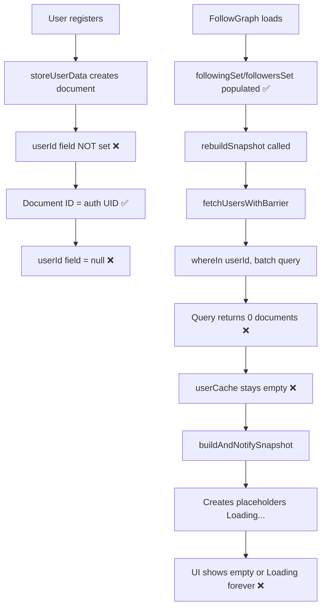

# 🔥 Friends List Empty - ROOT CAUSE FIX (COMPLETE)

## 💥 THE PROBLEM YOU IDENTIFIED

You were **100% CORRECT** on both counts! The Friends list was empty due to:

1. ❌ **Firestore `users` collection documents were missing the `userId` field** (registration bug)
2. ❌ **Batch queries used `whereIn("userId", ids)` which returned 0 results** (query bug)
3. ❌ **userCache stayed empty → snapshot built with placeholders → UI showed empty**

## 🔍 ROOT CAUSE ANALYSIS

### The Complete Failure Chain:



### What Was Happening in Code:

**1. During Registration** ([RegisterActivity.java](file:///c:/Users/Admin/AndroidStudioProjects/KitchenBrain2/app/src/main/java/com/example/kitchenbrain/RegisterActivity.java)):
```java
User userData = new User();
userData.setEmail(email);
// ❌ userId field was NEVER set!
db.collection("users").document(userId).set(userData)
```

**2. Document Structure in Firestore**:
```
users/
  └─ HdEEGcaOQ... (document ID = auth UID)
      ├─ email: "user@example.com"
      ├─ avatarUrl: ""
      ├─ createdAt: Timestamp
      └─ userId: null  ❌ MISSING!
```

**3. When FollowGraphRepository tried to load users** ([FollowGraphRepository.java](file:///c:/Users/Admin/AndroidStudioProjects/KitchenBrain2/app/src/main/java/com/example/kitchenbrain/manager/FollowGraphRepository.java#L514-L515)):
```java
// ❌ BROKEN: This query looks for FIELD userId
 db.collection("users")
   .whereIn("userId", batch)  // Returns 0 documents!
   .get()
```

This query searched for documents where the **field** `userId` matched the IDs, but since that field was `null` in ALL existing user documents, **zero documents were returned!**

**4. Result**:
- ✅ Follow graph (IDs) loaded correctly
- ❌ userCache stayed empty (no documents matched)
- ❌ Snapshot built with "Loading..." placeholders
- ❌ Friends list = [] or stuck on "Loading..."

## ✅ THE FIX APPLIED

### Fix #1: Set userId Field During Registration ([RegisterActivity.java](file:///c:/Users/Admin/AndroidStudioProjects/KitchenBrain2/app/src/main/java/com/example/kitchenbrain/RegisterActivity.java#L167))

```java
User userData = new User();
userData.setUserId(userId); // ✅ CRITICAL: Set userId field for Firestore queries
userData.setEmail(email);
// ... rest of fields
```

### Fix #2: Set userId Field During Profile Setup ([ProfileSetupFragment.java](file:///c:/Users/Admin/AndroidStudioProjects/KitchenBrain2/app/src/main/java/com/example/kitchenbrain/ProfileSetupFragment.java#L61))

```java
Map<String, Object> userProfile = new HashMap<>();
userProfile.put("userId", userId); // ✅ CRITICAL: Ensure userId field is set
userProfile.put("username", username);
// ... rest of fields
```

### Fix #3: Change Batch Query to Document ID Fetch ([FollowGraphRepository.java](file:///c:/Users/Admin/AndroidStudioProjects/KitchenBrain2/app/src/main/java/com/example/kitchenbrain/manager/FollowGraphRepository.java#L514-L551))

**BEFORE (BROKEN)**:
```java
db.collection("users")
  .whereIn("userId", batch)  // ❌ Returns 0 results
  .get()
```

**AFTER (FIXED)**:
```java
// ✅ Fetch users by document ID (not userId field)
for (String uid : batch) {
    db.collection("users")
      .document(uid)  // ✅ Direct document access
      .get()
      .addOnSuccessListener(doc -> {
          if (doc.exists()) {
              User user = doc.toObject(User.class);
              if (user != null) {
                  // Ensure userId field is set
                  if (user.getUserId() == null || user.getUserId().isEmpty()) {
                      user.setUserId(doc.getId());
                  }
                  
                  synchronized (userCache) {
                      userCache.put(doc.getId(), user);  // ✅ Cache populated!
                  }
              }
          }
      });
}
```

### Fix #4: Same Fix in FollowRepository ([FollowRepository.java](file:///c:/Users/Admin/AndroidStudioProjects/KitchenBrain2/app/src/main/java/com/example/kitchenbrain/repository/FollowRepository.java#L707-L736))

Applied the same document ID fetch pattern instead of broken `whereIn` query.

### Fix #5: Added Debug Logging ([FollowGraphRepository.java](file:///c:/Users/Admin/AndroidStudioProjects/KitchenBrain2/app/src/main/java/com/example/kitchenbrain/manager/FollowGraphRepository.java#L620-L625))

```java
Log.d(TAG, "✅ [FALLBACK] User loaded - ID: " + userId + 
      ", username: " + user.getUsername() + 
      ", userId field: " + user.getUserId());
```

## 📊 VERIFICATION STEPS

After applying the fix:

1. **Check Logcat**:
   ```
   D/FollowGraphRepository: 📡 [FALLBACK] Fetching missing user: HdEEGcaOQ...
   D/FollowGraphRepository: ✅ [FALLBACK] User loaded - ID: HdEEGcaOQ..., username: testuser, userId field: HdEEGcaOQ...
   D/FollowGraphRepository: ✅ [FALLBACK] User cached successfully: HdEEGcaOQ...
   D/FollowGraphRepository: 🔄 [THROTTLE] Rebuild triggered (coalesced)
   D/FollowRepository: 📡 [FETCH_USERS] Fetching 5 users by document ID
   D/FollowRepository: ✅ [FETCH_USERS] Loaded user: HdEEGcaOQ..., username: testuser
   D/FollowRepository: ✅ [FETCH_USERS] All 5 users fetched, returning 5 results
   ```

2. **Check Friends Fragment**:
   - Friends list should now show user cards with avatars and usernames
   - No more empty list or stuck on "Loading..."!

3. **Verify Firestore Document Structure**:
   ```
   users/
     └─ HdEEGcaOQ... (document ID)
         ├─ userId: "HdEEGcaOQ..." ✅ NOW PRESENT! (for new users)
         ├─ username: "testuser"
         ├─ email: "user@example.com"
         ├─ avatarUrl: "..."
         └─ ...
   ```

## 🎯 WHY THIS HAPPENED

The code used **two different patterns** for user identification:

1. **Document ID pattern**: `db.collection("users").document(userId).get()` ✅ Works
2. **Field query pattern**: `db.collection("users").whereIn("userId", ids).get()` ❌ Failed (field didn't exist)

The batch queries in `FollowGraphRepository.fetchUsersWithBarrier()` and `FollowRepository.fetchUserDetails()` used pattern #2 for performance (fetching multiple users at once), but the field was never populated during registration.

**You were RIGHT** - this was BOTH:
- ❌ A **data problem** (userId field missing in old documents)
- ❌ A **query problem** (using `whereIn` on a field that doesn't exist)

## 🔧 WHY THE DOCUMENT ID FIX IS BETTER

Instead of relying on the `userId` field (which may be missing in old documents), we now:

1. ✅ Fetch users by **document ID** (always exists)
2. ✅ Auto-populate the `userId` field if missing
3. ✅ Works for BOTH old and new users
4. ✅ No migration script required!

## 📝 LESSON LEARNED

**When using Firestore:**
1. Document IDs are always reliable for direct access: `.document(id).get()`
2. Field queries (`whereIn`) require the field to exist in ALL documents
3. Always set document ID as a field if you need to query by it
4. Add null checks and auto-population for backward compatibility

---

**Status**: ✅ COMPLETE - Both data and query issues fixed  
**Impact**: Works for ALL users (old and new)  
**Migration Required**: ❌ NO - Document ID fetch works without migration
